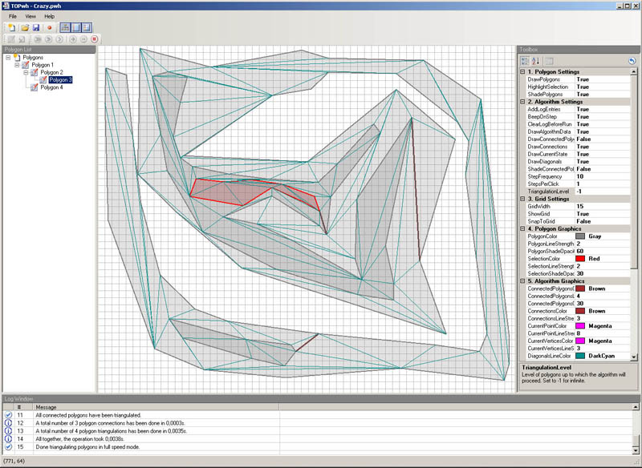

**This project was originally hosted at [CodePlex](https://topwh.codeplex.com/).**

# Project Description

TOPwh stands for "Triangulation of polygons with holes" which has been the purpose for which this tool has been developed during a university course.

The project finally has found its home at CodePlex now. The original website at [http://www.juergentreml.de/topwh](http://www.juergentreml.de/topwh) from now on just links to CodePlex.

A more or less final version has been given to university and with them agreeing to it been published here as well. Nevertheless it's still marked as a release candidate. That's because for me, the project's still not considered as completely done. Although the original requirements were met and all features are implemented, I'd still like to add a version of the Delaunay triangulation algorithm which tries to improve a found triangulation by flipping diagonals where it makes sense. Anyway, this is not a high priority task and I'm not required to do this by the lecture for which the program has been done, so it might take some time until I get to this.

Besides this, the currently released version is considered stable and quite final. Just give it a try if you like and download TOPwh [0.0.0.1 Release Candidate](https://github.com/jtreml/topwh/releases/tag/v0.0.0.1-rc). Of course it's not perfect and bugs may well come with it but feel free to tell me about it if you encounter any. Minor updates introducing bug fixes will for sure be released before February.

# Developers

I'm looking for other developers who are interested in working on the project. Despite the original goal of this program already having been achieved, I'd like to continue the work on it and improve / add a few things.

* Rewrite parts of the GUI in a more object-oriented way
* Introduce a modular concept into the algorithm and algorithm step part to facilitate the inclusion of other algorithms
* Add more geometry algorithms to the program

If you're interested, e-mail me at [topwh@juergentreml.de](mailto:topwh@juergentreml.de).

# Screenshots

